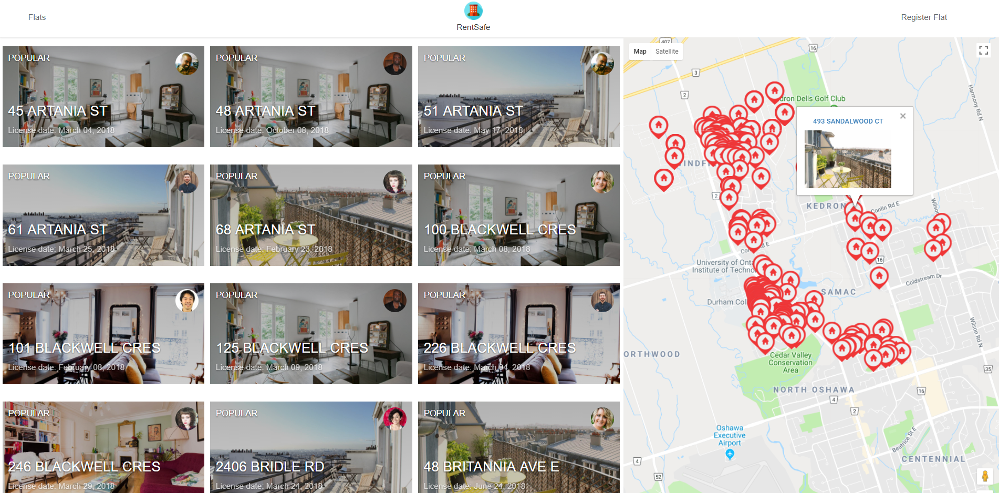
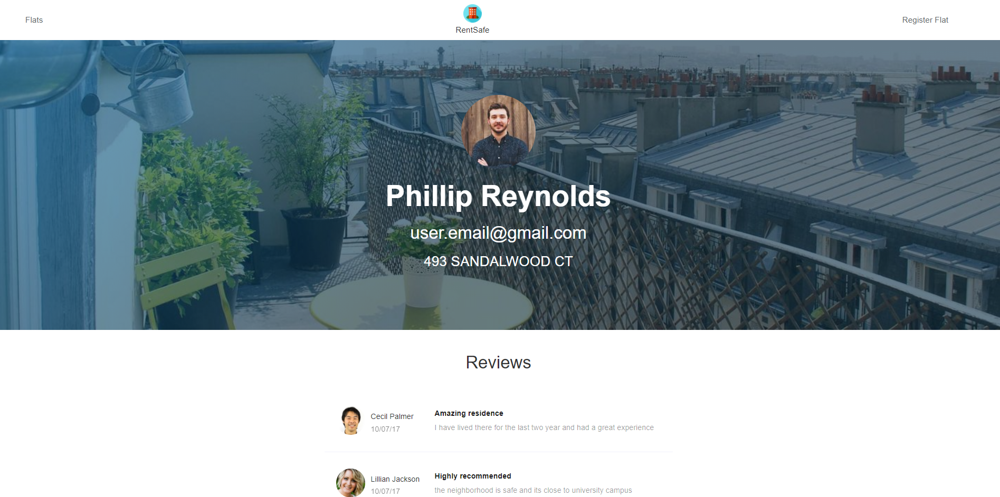

# [Click here to start application](https://safe-rent.herokuapp.com/)
Web application created using flask and python that shows a list of all licensed residences in the Durham region. 
  
<!--  -->
<kbd>

</kbd>
  
  
<kbd>

</kbd>
  
  
Steps to run application:  
1- clone the repository on your computer 
2- cd into the cloned directory from the command line 
3- type: pip install -r requirements.txt 
4- sign up for a google maps api key 
5- in app.py replace the line YOUR_API_KEY with your key 
6. type: python app.py in the command line
